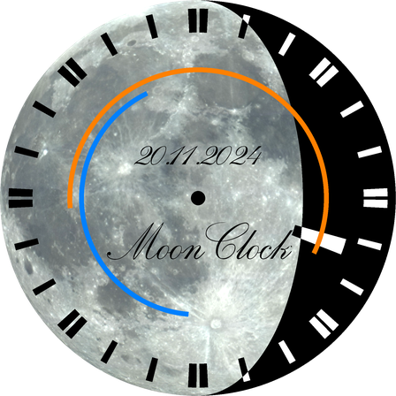
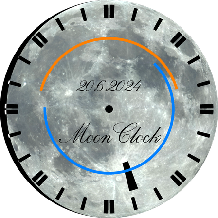
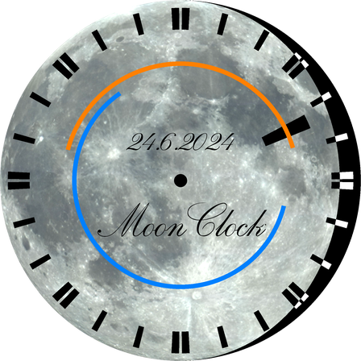

<!-- TOC -->
* [moon-clock](#moon-clock)
  * [Installation](#installation)
  * [Usage](#usage)
    * [API](#api)
    * [CLI](#cli)
  * [Examples](#examples)
<!-- TOC -->

---

# moon-clock

A 24h clock that shows sun and moon phases.

[](docs/media/moon_clock_2024-11-20.png)

The package was originally developed as a sub-package for
[JukeOroni](https://github.com/michimussato/jukeoroni) 
to display the time on a color e-ink screen, such as the 
[Pimoroni Inky Impression](https://shop.pimoroni.com/search?q=impression).

## Installation

```
pip install git+https://github.com/michimussato/moon-clock.git
```

## Usage

### API

```python
from moon_clock import MoonClock
from PIL import Image


mc: Image = MoonClock().get_clock(
    address="Sydney",
    size=640,
)
mc.save("my-moon-clock.png")
```

### CLI

```
$ moon-clock --help
usage: moon-clock [-h] [-v] [-vv] [-a ADDRESS] [-f OUT_FILE] [-i ISO]
                  [--moon-shadow-opacity MOON_SHADOW_OPACITY]

options:
  -h, --help            show this help message and exit
  -v, --verbose         set loglevel to INFO
  -vv, --very-verbose   set loglevel to DEBUG
  --moon-shadow-opacity MOON_SHADOW_OPACITY, -s MOON_SHADOW_OPACITY
                        Black dial background or transparent. (0<=moon-
                        shadow<=255).

save:
  -a ADDRESS, --address ADDRESS
                        Set Address
  -f OUT_FILE, --out-file OUT_FILE
                        Where to save the PNG to.
  -i ISO, --iso ISO     ISO timestamp like '2019-01-04T16:41:24+02:00'
```

```shell
moon-clock --address "Sydney" --out-file clock.png
```

A series of hourly images from 1.5.2019-31.5.2019

```shell
for d in $(seq -f "%02g" 1 31); do
   for h in $(seq -f "%02g" 0 23); do
       moon-clock -v -a "Sydney" -f clock_${d}_${h}.png -i "2019-01-${d}T${h}:00:00+02:00";
   done;
done
```

## Examples

Shortly before 11 PM, with the moon at it's highest:


About 4:15 PM, shortly before sunset:

